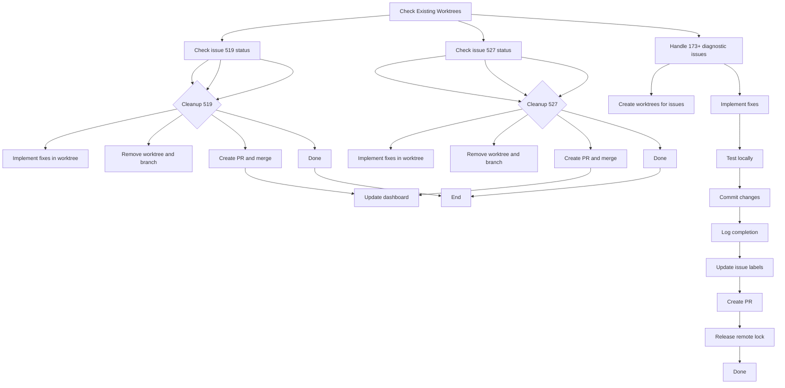

# GitHub Ralph Loop Continuation Plan

**Objective:** Continue GitHub Ralph Loop workflow while ignoring lane label requirements (ralph/owner:* labels)

**Date:** 2026-01-27

---

## Current State Assessment

### Infrastructure Status
- ✅ Ralph Loop scripts: logging, dashboard, lock management, issue creation
- ✅ Existing worktrees: issues 519 and 527
- ⚠️ 173+ compiler diagnostic issues in `github_issues.md` (need `ralph/workset` labels)
- ⚠️ Dashboard: empty (no recent Ralph Loop activity)
- ✅ No kill switch active (`.ralph-stop` and `RALPH_STOP` not present)

### Key Constraints
- **Ignore lane label requirements:** Do NOT add `ralph/owner:*` labels when claiming issues
- **Status labels only:** Use only `ralph/status:queued/in-progress/done/blocked` labels
- **Worktree workflow:** All work must happen in dedicated git worktrees
- **One issue per agent:** Work on single issue at a time

---

## Strategy

### For Existing Worktrees (Issues 519 and 527)
1. Check current status of worktrees
2. If in-progress: Continue working on the issue
3. If completed/stale: Clean up (merge or remove worktree)
4. If blocked: Investigate and either unblock or clean up

### For 173+ Compiler Diagnostic Issues
**Approach:** Work directly in local worktrees without creating GitHub issues
- **Rationale:** 
  - Issues are well-defined in `github_issues.md`
  - Each issue has clear file path, error type, and fix description
  - Working in local worktrees is faster and avoids GitHub API overhead
  - Can group related issues together in a single worktree
  - Use status labels (queued/in-progress/done/blocked) without owner labels
  - Focus on errors first, then warnings

---

## Implementation Plan

### Phase 1: Check Existing Worktrees

1. **Check worktree status for issue 519**
   - Navigate to `.worktrees/issue-519-ndarray-properties/`
   - Check git status and recent commits
   - Determine if work is in-progress or needs continuation

2. **Check worktree status for issue 527**
   - Navigate to `.worktrees/issue-527-export-functions/`
   - Check git status and recent commits
   - Determine if work is in-progress or needs continuation

3. **Decision point:**
   - If either worktree is actively in-progress: Continue with that issue
   - If both are completed/stale: Clean up both (remove worktrees and branches)
   - If one is blocked: Investigate and decide on next steps

### Phase 2: Handle 173+ Compiler Diagnostic Issues

**Option A: Create GitHub issues and work in worktrees**
1. Group related issues by file or error type
2. For each group, create a single worktree
3. Add `ralph/workset` label to each issue
4. Create worktree using Ralph conventions
5. Implement fixes in worktree
6. Add `ralph/status:in-progress` when starting
7. Add `ralph/status:done` when complete
8. Clean up worktree after completion

**Option B: Work directly in existing worktrees**
1. Select lowest-numbered issues (1, 2, 3...)
2. Work on issues sequentially in existing worktrees
3. Use status labels only (no owner labels)
4. Prioritize errors over warnings

### Phase 3: Workflow Execution (For New Worktrees)

For each issue/worktree:

1. **Create worktree**
   ```bash
   mkdir -p .worktrees
   git fetch origin
   git worktree add -b "ralph/issue-<num>-<slug>" ".worktrees/issue-<num>-<slug>"
   ```

2. **Acquire remote lock** (if working on GitHub issues)
   ```bash
   ISSUE=<num>
   LOCK_REF="refs/ralph-locks/issue-$ISSUE"
   git update-ref "$LOCK_REF" HEAD
   if git push origin "$LOCK_REF"; then
     echo "lock acquired"
   else
     git update-ref -d "$LOCK_REF" || true
     # pick another issue
   fi
   ```

3. **Update issue labels** (ignoring owner labels)
   ```bash
   # Add ralph/workset label
   gh issue edit <num> --add-label "ralph/workset"
   
   # Add status label (mutually exclusive)
   gh issue edit <num> --add-label "ralph/status:in-progress"
   
   # DO NOT add ralph/owner:* labels
   ```

4. **Log start**
   ```bash
   python3 scripts/ralph-log.py \
     --run-id "ralph-run-$(date +%s)" \
     --event "issue_selected" \
     --issue <num> \
     --agent "architect"
   ```

5. **Implement fix**
   - Navigate to worktree directory
   - Make code changes
   - Test locally
   - Commit with conventional commit style

6. **Log completion**
   ```bash
   python3 scripts/ralph-log.py \
     --run-id "ralph-run-$(date +%s)" \
     --event "fix_completed" \
     --issue <num> \
     --agent "architect"
   ```

7. **Update issue labels**
   ```bash
   # Remove in-progress, add done
   gh issue edit <num> --remove-label "ralph/status:in-progress"
   gh issue edit <num> --add-label "ralph/status:done"
   ```

8. **Create PR**
   ```bash
   gh pr create \
     --title "Fix: <issue title>" \
     --body-file <pr-body.md> \
     --base ralph/issue-<num>-<slug> \
     --head ralph/issue-<num>-<slug>
   ```

9. **Release remote lock** (always)
   ```bash
   ISSUE=<num>
   LOCK_REF="refs/ralph-locks/issue-$ISSUE"
   git push origin ":$LOCK_REF" || true
   git update-ref -d "$LOCK_REF" || true
   ```

### Phase 4: Workflow Execution (For Existing Worktrees)

1. **Navigate to worktree**
   ```bash
   cd .worktrees/issue-<num>-<slug>
   ```

2. **Implement next fix**
   - Make code changes
   - Test locally
   - Commit with conventional commit style

3. **Log progress**
   ```bash
   python3 scripts/ralph-log.py \
     --run-id "ralph-run-$(date +%s)" \
     --event "fix_in_progress" \
     --issue <num> \
     --agent "architect"
   ```

4. **Complete and clean up**
   - Test all changes
   - Commit final changes
   - Log completion
   - Merge to main (if appropriate) or create PR
   - Clean up worktree and branch

### Phase 5: Cleanup

1. **Remove stale worktrees** (after completion)
   ```bash
   git worktree remove ".worktrees/issue-<num>-<slug>"
   git branch -D "ralph/issue-<num>-<slug>" 2>/dev/null || true
   ```

2. **Remove stale branches** (if not merged)
   ```bash
   git branch -D "ralph/issue-<num>-<slug>" 2>/dev/null || true
   ```

---

## Ralph Loop Workflow Diagram



---

## Key Decisions Required

1. **Worktree Strategy for Compiler Issues:**
   - Create GitHub issues OR work in existing worktrees
   - Recommendation: Work in existing worktrees (faster, groups related issues)
   - Use status labels only (no owner labels)

2. **Issue Grouping Strategy:**
   - Group by file path (e.g., all `rust-numpy/src/advanced_reductions.rs` issues)
   - Group by error type (all E0433 Complex32 errors together)
   - Group by error code (all E0533 Dtype::Float64 errors together)
   - Prioritize errors over warnings

3. **Label Strategy:**
   - Add `ralph/workset` to all issues
   - Use status labels: queued → in-progress → done
   - NEVER add `ralph/owner:*` labels

---

## Notes

- This plan assumes worktrees 519 and 527 are either completed, in-progress, or blocked
- If both are completed/stale, clean up both before starting new work
- The "ignore lane label requirements" means we skip `ralph/owner:*` labels entirely
- All Ralph Loop logging goes to `.ralph/logs/` directory
- Dashboard can be regenerated with `./scripts/ralph-dashboard.py`
- Use `./scripts/ralph-dashboard-watch.py` for real-time updates
